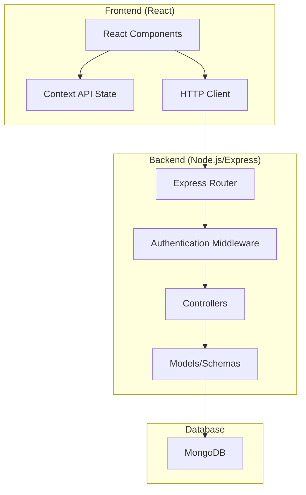

# Design Document: MERN Blog Application

## Overview

The MERN Blog Application is a full-stack web application built using MongoDB, Express.js, React, and Node.js. The system follows a three-tier architecture with a React frontend, Express.js/Node.js backend API, and MongoDB database. The application provides comprehensive blogging functionality including user authentication, content management, and social interaction features.

The architecture emphasizes security through JWT-based authentication, data validation, and XSS protection. The frontend uses React with Context API for state management, while the backend implements RESTful API design patterns with proper error handling and data serialization.

## Architecture

### System Architecture



### Technology Stack

**Frontend:**
- React 18+ with functional components and hooks
- Context API for global state management
- Axios for HTTP requests
- React Router for client-side routing
- CSS Modules or Styled Components for styling

**Backend:**
- Node.js runtime environment
- Express.js web framework
- JWT for authentication tokens
- bcrypt for password hashing
- Mongoose ODM for MongoDB interaction
- express-validator for input validation

**Database:**
- MongoDB with document-based storage
- Mongoose schemas for data modeling
- Indexing for query optimization

## Components and Interfaces

### Frontend Components

**Authentication Components:**
- `LoginForm`: Handles user login with email/password validation
- `RegisterForm`: Manages user registration with form validation
- `AuthProvider`: Context provider for authentication state management

**Blog Components:**
- `BlogPostList`: Displays paginated list of blog posts
- `BlogPostCard`: Individual post preview component
- `BlogPostDetail`: Full blog post view with comments
- `BlogPostForm`: Create/edit blog post interface
- `CommentSection`: Displays and manages post comments

**User Components:**
- `UserProfile`: User profile display and editing
- `UserPostsList`: Lists posts by specific user

**Layout Components:**
- `Header`: Navigation bar with authentication status
- `Footer`: Site footer with links
- `Layout`: Main layout wrapper component

### Backend API Endpoints

**Authentication Routes (`/api/auth`):**
- `POST /register` - User registration
- `POST /login` - User login
- `POST /logout` - User logout
- `GET /profile` - Get current user profile

**Blog Post Routes (`/api/posts`):**
- `GET /` - Get paginated blog posts
- `GET /:id` - Get specific blog post
- `POST /` - Create new blog post (authenticated)
- `PUT /:id` - Update blog post (authenticated, owner only)
- `DELETE /:id` - Delete blog post (authenticated, owner only)
- `GET /user/:userId` - Get posts by specific user

**Comment Routes (`/api/comments`):**
- `GET /post/:postId` - Get comments for a post
- `POST /post/:postId` - Add comment to post (authenticated)
- `DELETE /:id` - Delete comment (authenticated, owner only)

**User Routes (`/api/users`):**
- `GET /:id` - Get user public profile
- `PUT /profile` - Update user profile (authenticated)

### Middleware Components

**Authentication Middleware:**
- JWT token verification
- User session management
- Protected route enforcement

**Validation Middleware:**
- Input sanitization and validation
- XSS protection for HTML content
- Schema validation for API requests

**Error Handling Middleware:**
- Centralized error processing
- Consistent error response formatting
- Logging and monitoring integration

## Data Models

### User Schema

```javascript
{
  _id: ObjectId,
  username: String (required, unique, 3-30 chars),
  email: String (required, unique, valid email),
  password: String (required, hashed with bcrypt),
  joinDate: Date (default: now),
  createdAt: Date,
  updatedAt: Date
}
```

### BlogPost Schema

```javascript
{
  _id: ObjectId,
  title: String (required, 1-200 chars),
  content: String (required, min 10 chars),
  author: ObjectId (ref: User, required),
  createdAt: Date (default: now),
  updatedAt: Date,
  tags: [String] (optional),
  isPublished: Boolean (default: true)
}
```

### Comment Schema

```javascript
{
  _id: ObjectId,
  content: String (required, 1-1000 chars),
  author: ObjectId (ref: User, required),
  post: ObjectId (ref: BlogPost, required),
  createdAt: Date (default: now),
  updatedAt: Date
}
```

### Database Indexes

- User: `email` (unique), `username` (unique)
- BlogPost: `author`, `createdAt` (descending), `title` (text search)
- Comment: `post`, `createdAt` (descending)

## Authentication and Security

### JWT Authentication Flow

1. User submits login credentials
2. Server validates credentials against database
3. Server generates JWT token with user ID and expiration
4. Token sent to client and stored in memory/localStorage
5. Client includes token in Authorization header for protected requests
6. Server validates token on each protected endpoint

### Password Security

- Passwords hashed using bcrypt with salt rounds (minimum 12)
- Plain text passwords never stored in database
- Password strength validation on frontend and backend

### Data Validation and Sanitization

- Input validation using express-validator
- HTML content sanitization to prevent XSS attacks
- SQL injection prevention through Mongoose ODM
- CORS configuration for cross-origin requests

## State Management

### Frontend State Architecture

**Global State (Context API):**
- User authentication status
- Current user information
- Global loading states
- Error messages

**Local Component State:**
- Form input values
- Component-specific loading states
- UI interaction states (modals, dropdowns)

**State Structure:**

```javascript
// AuthContext
{
  user: User | null,
  isAuthenticated: boolean,
  isLoading: boolean,
  error: string | null
}

// BlogContext
{
  posts: BlogPost[],
  currentPost: BlogPost | null,
  pagination: {
    currentPage: number,
    totalPages: number,
    totalPosts: number
  },
  isLoading: boolean,
  error: string | null
}
```